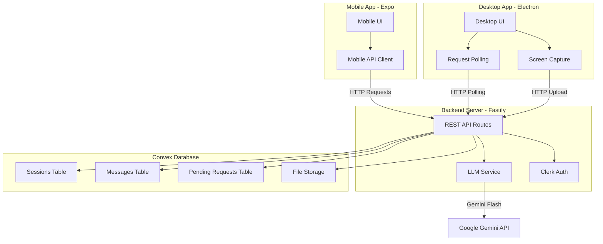

# Architecture Documentation

## System Overview

This document describes the architecture of the Remote Desktop AI Assistant system, including how desktop, mobile, and server components communicate and work together.

---

## High-Level Architecture



---

## Communication Architecture

### Request-Response Model

The system uses a **polling-based request-response architecture** where:

1. **Mobile → Server**: Direct HTTP requests (pairing, chat, recording control)
2. **Desktop → Server**: Polling every 2 seconds for pending requests + HTTP uploads
3. **Server → Convex**: HTTP API calls to Convex mutations/queries
4. **Server → LLM**: Direct API calls to Gemini for media analysis

### Communication Flow

```mermaid
sequenceDiagram
    participant M as Mobile
    participant S as Server
    participant C as Convex
    participant D as Desktop
    participant G as Gemini

    Note over D,S: 1. Desktop Registration
    D->>S: POST /api/desktop/register
    S->>C: sessions:create()
    C-->>S: sessionId
    S-->>D: {desktopId, pairingCode}

    Note over M,S: 2. Mobile Pairing
    M->>S: POST /api/mobile/pair {pairingCode}
    S->>C: sessions:findByPairingCode()
    S->>C: sessions:updateMobileConnected()
    S-->>M: {sessionId, desktopId}

    Note over M,S,D,G: 3. Screenshot Request Flow
    M->>S: POST /api/chat/:sessionId/message {requestScreenshot: true}
    S->>C: messages:create() (user message)
    S->>C: pendingRequests:create() (screenshot)
    S-->>M: {messageId, status: "requesting_screenshot"}

    D->>S: GET /api/desktop/:desktopId/pending-requests (polling)
    S->>C: pendingRequests:getByDesktop()
    C-->>S: [pending requests]
    S-->>D: {requests: [{type: "screenshot"}]}

    D->>D: Capture screenshot
    D->>S: POST /api/desktop/:desktopId/screenshot (multipart/form-data)
    S->>C: Store in file storage (future)
    S->>G: analyzeWithLLM(image, query)
    G-->>S: AI response text
    S->>C: messages:create() (assistant message)
    S-->>D: {screenshotUrl, status: "processed"}

    M->>S: GET /api/chat/:sessionId/messages
    S->>C: messages:getBySession()
    C-->>S: [messages]
    S-->>M: {messages: [...]}
```

---

## Component Architecture

### 1. Backend Server (Fastify)

**Location:** `apps/server/src/`

#### Directory Structure

```
apps/server/
├── src/
│   ├── index.ts              # Main server entry point
│   ├── plugins/
│   │   └── clerk.ts         # Clerk authentication plugin
│   ├── routes/
│   │   ├── desktop.ts       # Desktop endpoints
│   │   ├── mobile.ts        # Mobile endpoints
│   │   └── chat.ts          # Chat & AI endpoints
│   ├── services/
│   │   └── llm.ts           # Gemini LLM integration
│   └── types/
│       └── api.ts           # TypeScript type definitions
├── convex/
│   ├── schema.ts            # Database schema
│   └── functions/
│       ├── sessions.ts      # Session mutations/queries
│       ├── messages.ts      # Message mutations/queries
│       └── pendingRequests.ts # Request mutations/queries
└── package.json
```

#### Server Initialization Flow

```typescript
1. Load environment variables (dotenv/config)
2. Create Fastify instance
3. Register plugins:
   - CORS (@fastify/cors)
   - Multipart (@fastify/multipart) for file uploads
   - Clerk (@clerk/fastify) if auth keys provided
4. Register route modules:
   - desktopRoutes
   - mobileRoutes
   - chatRoutes
5. Start HTTP server (default port 3000)
```

#### Route Organization

**Desktop Routes** (`routes/desktop.ts`):
- `POST /api/desktop/register` - Register desktop, get pairing code
- `GET /api/desktop/:desktopId/pending-requests` - Poll for pending requests
- `POST /api/desktop/:desktopId/screenshot` - Upload screenshot
- `POST /api/desktop/:desktopId/video` - Upload video recording

**Mobile Routes** (`routes/mobile.ts`):
- `POST /api/mobile/pair` - Pair mobile with desktop using code
- `POST /api/recording/:sessionId/start` - Start recording request
- `POST /api/recording/:sessionId/stop` - Stop recording request

**Chat Routes** (`routes/chat.ts`):
- `POST /api/chat/:sessionId/message` - Send message, trigger LLM if media present
- `GET /api/chat/:sessionId/messages` - Get chat history

#### LLM Service

**File:** `services/llm.ts`

- **Default Model**: Gemini 1.5 Flash (fast, free tier)
- **Function**: `analyzeWithLLM(mediaBase64, mediaType, userQuery, model?)`
- **Supports**: Images and videos
- **Optional**: Can switch to Gemini Pro for better video analysis

---

### 2. Convex Database

**Location:** `apps/server/convex/`

#### Database Schema

**Sessions Table:**
```typescript
{
  desktopId: string          // Unique desktop identifier
  mobileConnected: boolean   // Whether mobile has paired
  pairingCode: string        // 6-character code for pairing
  userId?: string            // Optional Clerk user ID
  createdAt: number          // Timestamp
}
Indexes:
- by_pairing_code (for mobile pairing lookup)
- by_desktop_id (for desktop operations)
- by_user (for user-specific sessions)
```

**Messages Table:**
```typescript
{
  sessionId: Id<"sessions">  // Foreign key to sessions
  role: "user" | "assistant" // Message sender
  content: string            // Message text
  mediaType: "screenshot" | "video" | null
  mediaStorageId?: Id<"_storage">  // Convex file storage ID
  mediaUrl?: string          // URL to media file
  createdAt: number          // Timestamp
}
Indexes:
- by_session (for fetching chat history)
```

**Pending Requests Table:**
```typescript
{
  desktopId: string          // Desktop to notify
  requestType: "screenshot" | "start-recording" | "stop-recording"
  processed: boolean         // Whether desktop has handled it
  createdAt: number          // Timestamp
}
Indexes:
- by_desktop_id (for desktop polling)
- by_desktop_unprocessed (for unprocessed requests only)
```

#### Convex Functions

**Sessions Functions** (`convex/functions/sessions.ts`):
- `create` (mutation) - Create new session
- `findByPairingCode` (query) - Find session by pairing code
- `getById` (query) - Get session by ID
- `updateMobileConnected` (mutation) - Update connection status

**Messages Functions** (`convex/functions/messages.ts`):
- `create` (mutation) - Create new message
- `getBySession` (query) - Get all messages for a session

**Pending Requests Functions** (`convex/functions/pendingRequests.ts`):
- `create` (mutation) - Create pending request
- `getByDesktop` (query) - Get unprocessed requests for desktop

#### Server → Convex Communication

The server uses `ConvexHttpClient` from `convex/browser` to call Convex functions:

```typescript
// Lazy initialization pattern
function getConvexClient() {
  const url = process.env.CONVEX_URL || process.env.CONVEX_DEPLOYMENT_URL;
  return new ConvexHttpClient(url);
}

// In route handler
const convexClient = getConvexClient();
const session = await convexClient.query("sessions:findByPairingCode", {
  pairingCode,
});
```

---

### 3. Authentication (Clerk)

**Status:** Optional for prototype, implemented in backend

**Setup:**
- `src/plugins/clerk.ts` - Clerk plugin registration
- Server checks for `CLERK_PUBLISHABLE_KEY` and `CLERK_SECRET_KEY` env vars
- If present, Clerk is registered; routes can use `fastify.clerkVerify` or `fastify.clerkOptional`

**Authentication Flow:**
1. Mobile app authenticates with Clerk (email/password)
2. Clerk returns JWT token
3. Mobile includes token in `Authorization: Bearer <token>` header
4. Server verifies token with Clerk middleware
5. `request.auth.userId` available in protected routes

**Schema Integration:**
- `sessions.userId` (optional) - Links session to authenticated user
- Allows users to access sessions across devices if authenticated

---

## Data Flow Examples

### Example 1: Screenshot Request Flow

```
1. User types "How do I fix this error?" in mobile app
   ↓
2. Mobile → POST /api/chat/:sessionId/message
   Body: { message: "How do I fix this error?", requestScreenshot: true }
   ↓
3. Server:
   - Creates user message in Convex (messages:create)
   - Creates pending request (pendingRequests:create {type: "screenshot"})
   - Returns {messageId, status: "requesting_screenshot"}
   ↓
4. Desktop polls: GET /api/desktop/:desktopId/pending-requests
   ↓
5. Server queries Convex: pendingRequests:getByDesktop()
   Returns: {requests: [{type: "screenshot", requestId: "..."}]}
   ↓
6. Desktop receives request → Captures screenshot
   ↓
7. Desktop → POST /api/desktop/:desktopId/screenshot
   Body: multipart/form-data with screenshot file
   ↓
8. Server:
   - Extracts base64 from uploaded file
   - Calls analyzeWithLLM(imageBase64, "image", userQuery)
   - Gemini returns AI response
   - Creates assistant message in Convex (messages:create)
   ↓
9. Mobile polls: GET /api/chat/:sessionId/messages
   ↓
10. Server queries Convex: messages:getBySession()
    Returns: {messages: [userMessage, assistantMessage]}
   ↓
11. Mobile displays AI response in chat
```

### Example 2: Video Recording Flow

```
1. User taps "Start Recording" in mobile app
   ↓
2. Mobile → POST /api/recording/:sessionId/start
   ↓
3. Server:
   - Gets desktopId from session
   - Creates pending request (pendingRequests:create {type: "start-recording"})
   ↓
4. Desktop polls → Receives start-recording request
   ↓
5. Desktop starts MediaRecorder → Records screen activity
   ↓
6. User taps "Stop Recording" in mobile app
   ↓
7. Mobile → POST /api/recording/:sessionId/stop
   ↓
8. Server creates pending request (pendingRequests:create {type: "stop-recording"})
   ↓
9. Desktop polls → Receives stop-recording request
   ↓
10. Desktop stops recording → Compresses video → Uploads
    POST /api/desktop/:desktopId/video (multipart/form-data)
    ↓
11. User types: "Why did I get this error?"
    Mobile → POST /api/chat/:sessionId/message
    Body: { message: "Why did I get this error?", videoUrl: "data:video/mp4;base64,..." }
    ↓
12. Server:
    - Creates user message with videoUrl
    - Extracts base64 from videoUrl
    - Calls analyzeWithLLM(videoBase64, "video", userQuery)
    - Gemini analyzes video and returns response
    - Creates assistant message with AI response
    ↓
13. Mobile displays AI response in chat
```

---

## API Endpoints Reference

### Desktop → Server

| Method | Endpoint | Purpose | Request | Response |
|--------|----------|---------|---------|----------|
| POST | `/api/desktop/register` | Register desktop, get pairing code | None | `{desktopId, pairingCode}` |
| GET | `/api/desktop/:desktopId/pending-requests` | Poll for pending requests | None | `{requests: [{requestId, type, createdAt}]}` |
| POST | `/api/desktop/:desktopId/screenshot` | Upload screenshot | multipart/form-data (file) | `{screenshotUrl, status}` |
| POST | `/api/desktop/:desktopId/video` | Upload video | multipart/form-data (file, duration) | `{videoUrl, duration, status}` |

### Mobile → Server

| Method | Endpoint | Purpose | Request | Response |
|--------|----------|---------|---------|----------|
| POST | `/api/mobile/pair` | Pair with desktop | `{pairingCode}` | `{sessionId, desktopId}` |
| POST | `/api/recording/:sessionId/start` | Start recording | None | `{recordingId, status}` |
| POST | `/api/recording/:sessionId/stop` | Stop recording | None | `{status: "stopping"}` |
| POST | `/api/chat/:sessionId/message` | Send message, trigger LLM | `{message, requestScreenshot?, videoUrl?}` | `{messageId, aiResponse?, status}` |
| GET | `/api/chat/:sessionId/messages` | Get chat history | None | `{messages: [...]}` |

---

## Environment Variables

### Required

- **`CONVEX_URL`** - Convex deployment URL (from `.env.local` after running `npx convex dev`)
  - Format: `https://your-project.convex.cloud`
  
- **`GEMINI_KEY`** - Google Gemini API key
  - Get from: https://aistudio.google.com/apikey

### Optional

- **`CLERK_PUBLISHABLE_KEY`** - Clerk publishable key (if using auth)
- **`CLERK_SECRET_KEY`** - Clerk secret key (if using auth)
- **`PORT`** - Server port (defaults to 3000)

### Environment File Setup

1. Run `npx convex dev` in `apps/server/` - creates `.env.local` with `CONVEX_URL`
2. Create `apps/server/.env` with:
   ```bash
   CONVEX_URL=https://your-project.convex.cloud  # Copy from .env.local
   GEMINI_KEY=AIzaSy...
   CLERK_PUBLISHABLE_KEY=pk_test_...  # Optional
   CLERK_SECRET_KEY=sk_test_...       # Optional
   PORT=3000                          # Optional
   ```

---

## Key Design Decisions

### 1. Polling vs WebSockets

**Decision:** Use polling (2-second interval) for desktop requests

**Why:**
- Simpler implementation for prototype
- No connection management overhead
- Desktop polls infrequently (only when connected)
- Can upgrade to WebSockets later if needed

### 2. Lazy ConvexClient Initialization

**Decision:** Create `ConvexHttpClient` inside route handlers (not at module level)

**Why:**
- Ensures environment variables are loaded before client creation
- Avoids "Invalid deployment address" errors
- Simple pattern: `const convexClient = getConvexClient()` in each handler

### 3. Single LLM Model (Gemini Flash)

**Decision:** Use only Gemini Flash, removed model selection from schema

**Why:**
- Simplifies prototype (no model switching UI needed)
- Gemini Flash is fast and free (15 RPM)
- Can still switch to Pro in backend code if needed for better video analysis

### 4. Optional Authentication

**Decision:** Clerk auth is optional - pairing code works without auth

**Why:**
- Allows quick testing without auth setup
- Pairing code provides sufficient security for prototype
- Can enable Clerk when needed by adding env vars

---

## Current Implementation Status

### ✅ Completed

- [x] Convex database schema (sessions, messages, pendingRequests)
- [x] Convex functions (mutations and queries)
- [x] Fastify server setup with CORS and multipart
- [x] All API endpoints (desktop, mobile, chat)
- [x] LLM service with Gemini Flash integration
- [x] Clerk authentication plugin (optional)
- [x] Environment variable loading with dotenv
- [x] TypeScript type definitions

### 🚧 In Progress / Next Steps

- [ ] Desktop app: Screenshot capture implementation
- [ ] Desktop app: Screen recording with MediaRecorder
- [ ] Desktop app: Polling logic for pending requests
- [ ] Desktop app: File upload to server
- [ ] Mobile app: Clerk auth setup (sign-in/sign-up screens)
- [ ] Mobile app: Pairing screen UI
- [ ] Mobile app: Chat interface with message display
- [ ] Mobile app: API integration with TanStack Query
- [ ] Convex file storage: Full implementation for media storage

---

## Future Enhancements

1. **WebSocket Support**: Replace polling with real-time WebSocket connections
2. **Video Compression**: Compress videos before upload to reduce bandwidth
3. **Model Selection UI**: Add UI to switch between Gemini Flash and Pro
4. **Chat History Persistence**: Full implementation with Convex file storage
5. **Error Handling**: Comprehensive error handling and retry logic
6. **Rate Limiting**: Protect LLM endpoints from abuse
7. **Browser Tab Information**: Capture active browser tabs
8. **File System Browsing**: Explore file system and send context to AI

---

## References

- [Fastify Documentation](https://fastify.dev/docs/latest/)
- [Convex Documentation](https://docs.convex.dev/)
- [Clerk Fastify Quickstart](https://clerk.com/docs/fastify/getting-started/quickstart)
- [Google Gemini API](https://ai.google.dev/docs)
